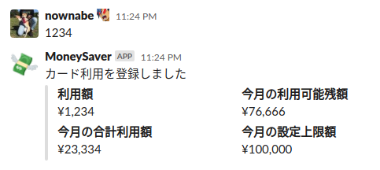

MoneySaver
==========

MoneySaver is a Slack App that counts the amount of money you spend this month and tells you how much money you can have in this month.

## Deploy

See examples.

* [Full terraform example for Cloud Run](https://github.com/nownabe/moneysaver/tree/main/examples/terraform)
* [Simple deploy script for Cloud Run](https://github.com/nownabe/moneysaver/blob/main/deploy.sh)

## Docker images

* [Docker Hub](https://hub.docker.com/repository/docker/nownabe/moneysaver)

## Environment variables

* `PROJECT_ID`: Google Cloud project ID that hosts Firestore.
* `SLACK_BOT_TOKEN`: Slack bot token.
* `SLACK_VERIFICATION_TOKEN`: Slack verification token.
* `LIMITS`: Pairs of a Slack channel ID and your monthly limit separated by commas.
  * example: `ABCXXX:100000,DEFYYY:20000`
